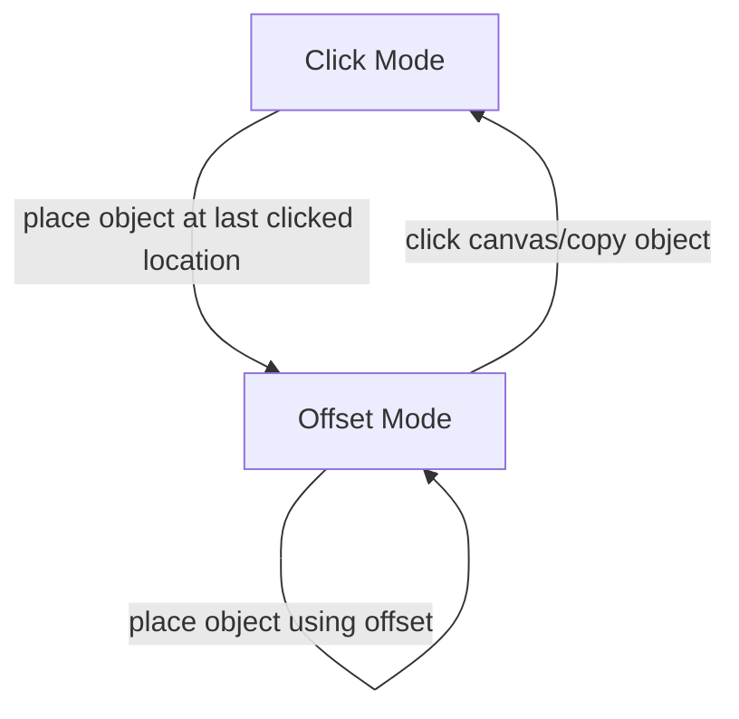

# Building Networks

This page gives intuitions about the Simbrain interface. More details on the underlying logic are in [updateLogic](updateLogic.html) For an overview of networks and how to build them in Simbrain, see the [building networks](https://www.youtube.com/watch?v=dvJvY1zVQUE) video. This page focuses an adding nodes and configuring screen objects. Be sure to familiarize yourself with Simbrain's [key commands](../quickstart.html), which were carefully designed to allow for fast editing.

# Basics

Basic editing is straightforward, and most actions are meant to be intuitive relative to any standard draw program which involves selecting, copying, and editing with double clicks etc. For the most part you simply left click and drag the selected items (more on selection below). Network models can be lasso selected and the selection edited using the shift key to toggle selection.

- Nudging: For fine tuning a selection, users can also use the arrow keys (with Shift held down) to "nudge" selected items. The nudge amount in pixels can be set in the network preferences dialog.

- Zooming: To zoom use the mouse-wheel or the pinch-to-zoom gesture on trackpads, or the toolbar buttons, which include zoom to fit (fit everything on the page automatically) or reset, which places the zoom level at 1:1. Auto-zoom mode makes things always zoom to fit.

- Panning: To pan press the command /ctrl key while left-clicking and dragging. Note that by default auto-zoom is turned on; if you plan to zoom in and pan a lot it should be turned off by dclicking on the auto-zoom icon. 

# Creating Objects

Primarily nodes are discussed here, but similar ideas apply for text objects, neuron groups, and other Simbrain objects. 

- Creating a node: Nodes are created by pressing "P" or by pressing the new node button  in the toolbar. Any new nodes will be created at the last position clicked on-screen.

- Creating a line of nodes: Repeatedly pressing "P" or the new node button results in a line of nodes being created beginning at the last clicked position.
 
- Creating specific types of neurons: By default, new nodes are linear. The default node type cannot currently be changed, though this is planned. To create a node of a specific type, simply create a new node, double click or right click the node and edit (or click command-E). From there one can select any neuron type in Simbrain from a dropdown menu. The same thing can be done for groups of nodes: select them all and double clcik on one
 
- Add neurons dialog: To create many nodes at once one can go to `Insert > Add Neurons` and instantly create an arbitrary number of neurons specified in the `Add Neurons` window. You can determine what type of neurons will be created (this part of the dialog is the same as the neuron dialog) and how they will be layed out (see layouts). There is also a checkbox which will make these neurons be created as a group.
 
- Copy / Paste / Duplicate: Create a node, set its type (as specified above), and then copy and paste or duplicate (command-D) repeatedly.
 
- Creating subnetworks or groups of nodes: Subnets are created using *Insert > Add Network*. Subnetworks and small groups of neurons can be created, copied, and repeatedly pasted to quickly create many sets of similar elements. Neuron groups can be created using the G command; existing loose nodes can be added to a network with Shift-G.
 
- Creating synapses or synapse groups: See the connections documentation.

# Selecting Objects

Neurons, weights, groups, and textboxes can be selected so that operations can be performed on the selected group of items (e.g., randomizing selected items, nudging them up or down, etc.). Selecting neurons and weights is important, because many Simbrain operations apply to selected sets of weights and/or nodes. Groups are selected by their interaction boxes. The selection interface basically works the way most computer drawing programs work. Use the left-click button to "lasso" or "rubberband" screen items. Once some items are selected, you can hold down the shift key and single-click to fine tune your selection.

Note that most selection operations must be done in selection mode, the default mode, which is entered by pressing "S" or the selection button.

- Lasso: Left-click and drag the lasso around screen items you want to select. As items are selected a box appears around them.

- Lassoing weights: It can be hard to click on individual weights directly, so they can also be selected by dragging the lasso across the line associated with a weight, which is much easier.

- Single click: Single left-click on nodes and weights to select individual screen items. Zooming in on items can facilitate this.

- Shift key : Once some items are selected, you can hold down the shift key to add more items to your selection. Hold down Shift while lassoing to add or remove groups items; hold down Shift while single-clicking to add or remove single items.

- Key Shortcuts : "n" to select all nodes; "w" to select all weights; "a" to select nodes and weights. These are super useful! (Also, once selected: "r" to randomize, "c" to clear, and arrows to increment activation.)

# Source-Target

One common motif that we use for several operation is a source-target operation, where one set of models is designated as source (red), and the other as target (green). 

The easiest way to do this is to select using the operations above, and then to press the `1` key to make those objects source objects. At that time they will be surrounded by a red border. (To get rid of this click in a neutral area and press `1` again).   Followup actions also use number keys like `2` and `3` to connect thigns.

Here are some source and target neurons which are about to connected in a feed-forward way.

This technique is used in connecting neurons, neuron groups, and neuron arrays together, in using immediate learning, and in other ways. It is one of the few cases where we had to come up with our own new UI innovation, but in our experience it's quite easy to learn and get used to.

Summary: 
- After pressing `1`, A red square should appear around every source neuron. 
- After making a connection with `2`, a line connecting each source neuron to their target neuron.
- Source neurons will remain selected unless cleared or until a new source neuron is designated. To deselect a source neuron without having to create another, click on an empty space in the network and press `esc` or `1` 

# Connection Methods

There are three main ways to connect neurons to other neurons (or to themselves) with synapses.

<!-- TODO: Link to polarity discussion -->
Note that these methods are designed to respect neuron polarity, if it is used. 

## Quick-Connect (1-2 keyboard method)

To perform the 1-2 method: Select your desired source neuron(s), designate them as source by pressing `1`. Select your desired target neuron(s) then designate them as target by pressing `2`. 

## Menu Commands

To use menu commands: Select your desired source neuron(s), designate them as source by right-clicking on one of the selected neurons (if more than one is selected) and connect (all-to-all) by right-clicking on one of the selected neurons and clicking `Connect Neurons`. This will open up a window that gives you the option of customizing your connection preferences.

## Groups and Collections

<!-- Links -->
1-2 can be used on interaction boxes for groups and collections to make a weight matrix connecting two groups. 

1-3 can be used to make a synapse group rather than a weight matrix.

# Repeat??

# Connecting Neurons
Video instruction on connecting neurons is [here](https://www.youtube.com/watch?v=dvJvY1zVQUE) (6:36 in the building networks video).

Perhaps one of the most essential parts of building a network aside from creating the neurons is connecting those neurons to other neurons (and sometimes the same neurons). Connections embody the GUI component of **synapses** in Simbrain, and therefore graphically allow the one to manipulate the parameters of the synapses connecting one set of neurons to another. In addition to granting access to underlying synapses, connections and their related GUI components allow one to determine the topology of how (out of a multitude of ways) one set of neurons can connect to another. In the side menu are pages dedicated to each of the standard ways neurons can be connected in Simbrain.

The quick and easy way to connect loose neurons is with the **quick 1 2** method!

## Source and Target Items

Various commands in Simbrain (e.g: connecting nodes, training weights, viewing weight matrices) require you to specify a set of source and target neurons (or neuron groups). Source neurons are surrounded by red squares and target neurons are surrounded by the standard green selection squares. Here is an example.

<!-- TODO --> Add Image

The same ideas and visual conventions apply to neuron groups, which can be selected via their **interaction boxes** and connected with **synapse groups**.

The main actions required to set up source and target neurons are as follows:

- To set source neurons: select a group of neurons and either (1) press the "1" key, (2) right click and select Connect > Set Source Neuron(s), or (3) use the Edit menu and *select Connect > Set Source Neuron(s)*.

- To set target neurons: simply select neurons as usual.

- To clear all source neurons: unselect all neurons (by clicking outside of any neuron), and (1) press the "1" key or (2) right click and select Connect > Set Source Neuron(s), or (3) use the Edit menu and select *Connect > Set Source Neuron(s)*.

- To clear specific source neurons: select the neurons of interest and (1) right click and select *Connect > Clear Source Neuron(s)*, or (2) use the Edit menu and select *Connect > Clear Source Neuron(s)*.

Note that when creating recurrent connections the same neurons will be both sources and targets.

## Main Connection Methods

Neurons can be connected by synapses in several different ways:

- The Quick Keyboard 1-2: Select source neurons, designate them as source by pressing "1", select target neurons, and connect (all to all) by pressing "2". Repeat as needed to connect series of neurons. This tends to be easy to get the hang of, and once the commands are familiar, many neurons can be quickly connected in this way.

- Menu Commands: Sam as the keyboard 1-2 but using the relevant menu commands to set as source and make the connections.

- Connection Objects: At the point that a connection is made using the "2" button, one can opt to create a special type of set of connections (not just all to all), and can also customize what the synapse strengths will be, using one of the built-in connection objects. See the pages in the sub-menu above.

- Scripts: Highly customized connections (e.g. those used in the cortical branching script) can be created using **scripts**.

## Editing Connections

Synapses are usually created as simple excitatory synapses with no special properties. Once created, synapses can be edited by double-clicking or using the synapse adjustment panel. Synapses in **synapse groups** have a complex suite of tools for viewing and customizing.

# End repeat??

# Setting Properties

Many properties are set using a [property dialog](../utilities/propertyEditor.html). For most items you can select in one of these ways:

1. Double-click on of the selected items
2. Right-click and select `set properties` in the popup menu
3. Clicking command-E or selecting `network > edit > set neurons or network > edit > set weights`

This works for single or in some cases multile objects of the same type. For multiple nodes

Examples:

- Set activation values for nodes: The activation value (and hence color) of neurons and the excitatory or inhibitory strength (and hence color and size) of weights can be manually adjusted. To do so, select one or more neurons and weights (both can be adjusted at the same time), and press the up and down arrow keys to increase or decrease these values. The amount increased or decreased is set by the "increment" field. Right and left arrow keys can also be used to increase or decrease these value.
- Clearing and randomizing values: Note that while screen items are selected, neuron values can also be set to zero by pressing "C" on the keyboard (weight values are not then set to zero, because this is equivalent to deleting them, which can be done with the delete key). Pressing "R" will randomize all selected screen items, neurons and weights.
- To clear nodes you select them and press `C`
- To clear weights you select them and press `Shift-C` (this prevents accidentally clearing them)
- To clamp or freeze nodes or weights use `Shift-F`

# Copy and Paste

Selected items (including neuron groups, but not yet subnetworks) can be copied, cut, and paste similarly to the way they are on most contemporary GUI's. Lasso select groups of items, then fine tune your selection using Shift to add or remove items.

Copy, cut, and paste in one of the following ways

1. Use standard keyboard shortcuts: control-C (copy), control-X (cut), control-V (paste).
2. Use the network menu and select copy, cut, or paste.
3. Right-click on one of the selected items and select copy or cut

Smart copy/paste: Copy neurons, paste, move, and re-paste, and the new paste’s follow the rule (see placement manager and paste trails below). In this way you can quickly build big networks.

# Wand Tool

The wand is used to create patterns of activation on sets of neurons. It can be thought of as a kind of virtual electrode, a way of injecting current in a network.

Some ways it can be used are to set the patterns to be learned by a Hopfield Network or to dynamically inject activation in to a running simulation.

As of the current version of Simbrain the wand only injects activation. Other uses for the wand tool are planned for future releases.

## Using the wand

To use the wand:

1. Click on the wand icon
2. Pass the wand over neurons while left-clicking
3. All neurons will reach their maximum level (the “upper bound” value), as shown in the image.

## Adjusting the wand

To adjust the size of the wand in pixels (and thus how many neurons are affected by the wand) set the wand radius field in the network preferences dialog.

# Placement Manager and Paste Trails

Manages intelligent placement of network models in the GUI. Often we want to create sets of neurons in a line from a specific points. This can be customized in Simbrain.

The system works via two modes:

1. Click mode: Objects are placed wherever you last clicked on screen.

2. Offset mode. Additional objects are at an offset from the last placed object. This allows "paste trails" to be created.

Offsets differ sepending on what type of object it is, so that objects are placed at a nice offset from one another.

## Custom offsets for paste trails

The default offsets are horizontal and so paste trails occur from left-to right creating horizontal lines of neurons, neuron groups, etc. However, sometimes it's desirable to create, say, a vertical line.  To set a custom offset use option drag. Click on a model, hold down option, and move the model to a custom location relative to the last-created model. A red line is shown indicating what the custom offset will be.

## State diagram

Here is a state diagram explaining how the system works:

