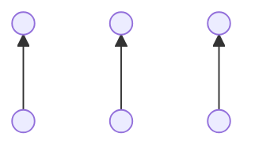
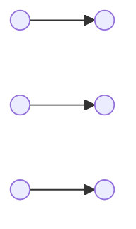
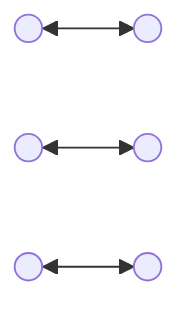

# One To One

Connects each source neuron to a single corresponding target neuron based on their spatial positioning on the canvas. This strategy ignores logical ordering (neuron IDs, creation order) and only considers physical X,Y coordinates.

The strategy works by:

1. Examining where neurons are physically positioned on the canvas
2. Determining if each group is arranged vertically (height > width) or horizontally (width > height)
3. Sorting neurons by Y coordinate (if vertical) or X coordinate (if horizontal)
4. Pairing them up in whatever way minimizes crossed connections

In addition to the examples below, diagonal connections can be formed which tend not to cross each other.

## Parameters

- **Bi-directional**: If true, synapses are added in both directions (source→target and target→source).

## Examples

Tip: for non bi-directional cases you can change the direction just by which neurons are designated source vs. target when you use the [1-2 or 1-3 trick](/docs/network/buildingBasics.html#quick-connect-1-2-and-1-3-tricks).

### Vertical arrangement

### Horizontal arrangement 

### Bidirectional

