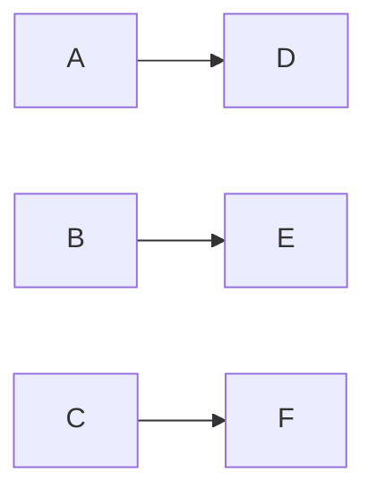
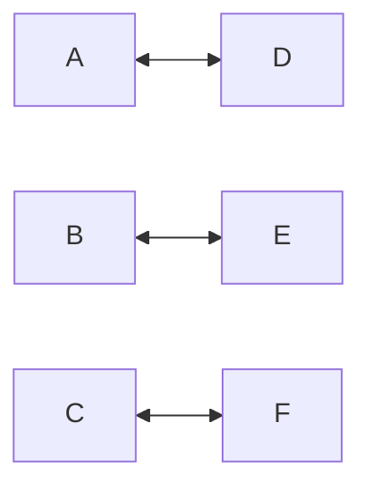

# One To One

Connects each source neuron to a single corresponding target neuron based on their spatial positioning on the canvas. This strategy ignores logical ordering (neuron IDs, creation order) and only considers physical X,Y coordinates.

The strategy works by:
1. Examining where neurons are physically positioned on the canvas
2. Determining if each group is arranged vertically (height > width) or horizontally (width > height)
3. Sorting neurons by Y coordinate (if vertical) or X coordinate (if horizontal)
4. Pairing them up in order, automatically reversing the target list if needed to avoid crossing connections

## Parameters

- **Bi-directional**: If true, synapses are added in both directions (source→target and target→source).

## Examples

### Basic One-to-One

Result: A→D, B→E, C→F

### Bidirectional

Result: A→D, D→A, B→E, E→B, C→F, F→C
