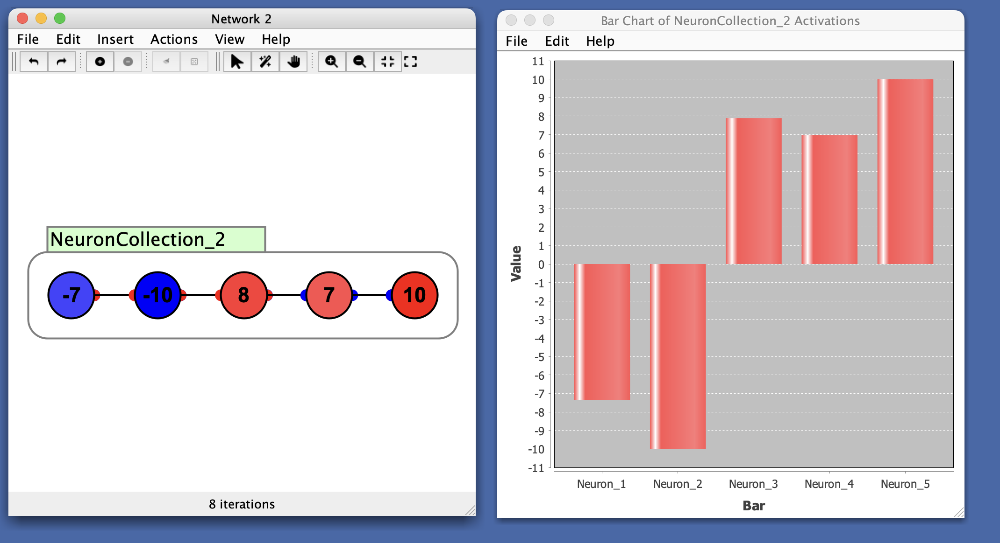

# Bar Chart

A standard bar chart that can be used to represent changing set of quantities, using a [vector coupling](/docs/workspace/couplings.html#vector-couplings). For example, it is often useful to represent the activations of a group of neurons using bar chart and to watch how they change in time as the simulation runs, to get a sense of the relative activation of each neuron. 

In this example, notice the first two nodes are negative and last three are positive, which is reflected in the chart.

# Preferences

- **Lower Bound**: Minimum value of the y-axis.
- **Upper Bound**: Maximum value of the y-axis.
- **Auto Range**: When checked, automatically scales the y-axis so that the largest bar fits inside the window. It can be useful to turn this off to get a better sense of overall changes in magnitude, since while it is on the bars will fill up the window.
- **Bar Color**: Color of the bars in the chart.

# Menus

## File 
- **Import from XML**: Load a previously saved bar chart.
- **Export to XML**: Save the current bar chart.
- **Rename**: Rename the bar chart window.
- **Close**: Close the plot window.

## Edit
- **Preferences**: See [preferences](#preferences).

## Right-Click Menu

- The context menu is a [JFreeChart menu](./#jfreechart-right-click-menu).