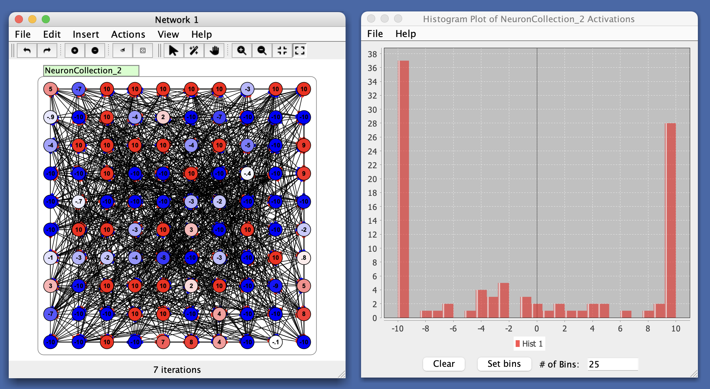

# Histogram

A **histogram** can be used to represent a probability distribution of values. It can be used as a component that is coupled (via a **vector coupling**) to in live simulations (for example, to view the distribution of activations in a population of neurons) and is also used in various components, e.g. the **weight visualization** for Synapse groups.

A histogram partitions the range of a given dataset into some number bins, and counts the number of values in the data set which fall into each bin. In Simbrain bins equally divide the range of the dataset such that each bin takes on the same width, though this is not always true of histograms generally.

For example, in a set of 20 synapses, if 10 synapses have a strength between 0 and 1 and another 10 have a strength between -1 and 0, then we would have two bins of the same height. The same panel is also embedded in the Synapse Adjustment panel, where the strengths of a selected group of synapses are displayed and adjusted.

As with other plots, several simultaneous datasets (histograms) can be displayed. Unlike other plots, the number of datasets that can be displayed can be dynamically changed. All histogram plot components are restricted to representing 4 histograms. To represented more data open another histogram plot.

  
`36/100 neurons are at minimum value while 27/100 are at their max`

# Menus

## File Menu

- **Import from xml**: Imports a bar chart from a stored .xml file.
- **Export to xml**: Exports the current bar char to a .xml file.
- **Rename**: Renames current bar chart window.
- **Close**: Closes the current bar chart.

## Help

- **Help**: Link to Simbrain Documentation

## Right-Click Menu

- The context menu is a **[JFreeChart menu](./#jfreechart-right-click-menu)**.
