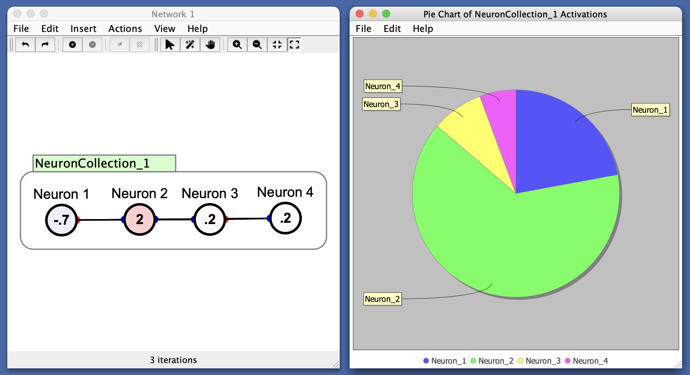

# Pie Chart

A standard [pie chart](https://en.wikipedia.org/wiki/Pie_chart) for representing the relative sizes of a set of quantities.

In Simbrain, slice sizes are determined by the absolute values of the input vector. This means a large negative activation will be treated the same as a large positive activation, and both will take up a proportionally larger "slice of the pie".

  

This can useful for visualizing how activations are distributed across a set of neurons. For example:
- If one neuron dominates, its slice will be large.
- If all neurons are equally active, slices will be equal.

Similarly for weight strengths, etc. 

# Preferences

- **Empty Pie Threshold**: If the *total* activation (sum of absolute values) falls below this threshold, the chart displays a single "Empty pie" slice. This prevents the appearance of misleading visuals when all values are near zero. To always show the relative proportions of even small values, set this threshold to 0. This can be useful to prevent cases where (for example) all of a neuron's activations die down to nearly 0 but the relative small values are still shown. If interested in showing these relationships simply set this threshold to 0.

# Menus

## File

- **Import from xml**: Imports a bar chart from a stored .xml file.
- **Export to xml**: Exports the current bar char to a .xml file.
- **Rename**: Renames current bar chart window.
- **Close**: Closes the current bar chart.

## Edit

- **Preferences**: See [preferences](#preferences)

## Help

- **Help**: Link to Simbrain Documentation

## Right-Click Menu

- The context menu is a **[JFreeChart menu](./#jfreechart-right-click-menu)**.