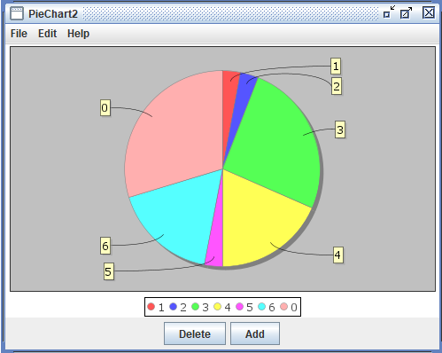

# Pie Chart

Pie chart is a standard pie chart that can be used to represent the relative sizes of a set of quantities in a Simbrain simulation. For example this can be useful for representing how evenly distributed a set of neural activations is. When one neuron dominates, it will take up a larger slice. When all neurons are equally active, all slices will be of equal size.

## Menus

## File

- **Import from xml**: Imports a bar chart from a stored .xml file.
- **Export to xml**: Exports the current bar char to a .xml file.
- **Rename**: Renames current bar chart window.
- **Close**: Closes the current bar chart.

## Edit

- **Preferences**: Allows you to set the pie charts appearance.
    - **Empty Pie Threshold**: Sets pie charts threshold.

## Help

- **Help**: Link to Simbrain Documentation

## Right-Click Menu

- The context menu is a **[JFreeChart menu](./#jfreechart-right-click-menu)**.