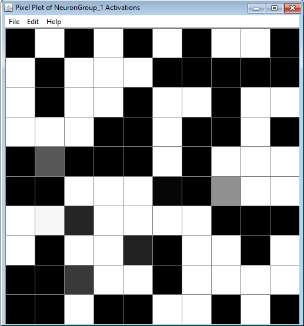

# Pixel plot

A simple pixel representation of an array or matrix of values. A common use is to represent activations of a neuron collection or neuron array. 

When coupling to this plot an appropriate number of pixels are selected and "squared". For example, an array of 24 or 25 values is represented by a 5x5 array, in the former case with one pixel unused.

Use the plot by [coupling](../workspace/couplings.html) to `setBrightness`, `setRed`, `setGreen`, or `setBlue`.  All channels assume values between 0 and 1. To understand the results study how the [RGB color space](https://en.wikipedia.org/wiki/RGB_color_spaces) works. The red, green and blue channels can be simultaneosly coupled to, to simulate color mixing, but note that brightness writes to all three channels and so if you use brightness _and_ the RGB channels you could get counter-intitive results.

# Menus

## File

- **Import from xml**: Imports a pixel chart from a stored .xml file.
- **Export to xml**: Exports the current pixel chart to a .xml file.
- **Rename**: Renames current pixel chart window.
- **Close**: Closes the current pixel chart window

## Edit

- **Preferences**: Invert brightness. By default, (0,0,0) in RGB space maps to black and (1,1,1) white. But when representing neural activations it is more natural to map zeros to white and one's to white.  Only applies to brightness.

## Help

- **Help**: Link to Simbrain Documentation

## Right-Click Menu

- The context menu is a **[JFreeChart menu](./#jfreechart-right-click-menu)**.

