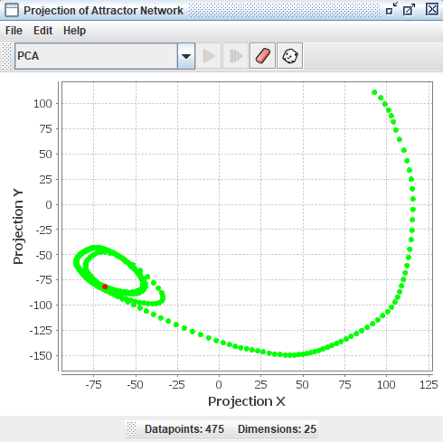

# Projection Plot

The projection component is derived from a program called [HiSee](https://hisee.sourceforge.net/). HiSee is a high dimensional visualizer; it lets you "see" "hi"-dimensional data. The plot uses [dimensionality reduction](https://en.wikipedia.org/wiki/Dimensionality_reduction) techniques, such as [PCA](https://en.wikipedia.org/wiki/Principal_component_analysis) and [multidimensional scaling](https://en.wikipedia.org/wiki/Multidimensional_scaling). It can be used to represent any high dimensional data, but in Simbrain it is primarily used to study the dynamics of a neural network.

The projection component can take all the states (patterns of activation) that occur for a network, which exist in a high dimensional space, and project them down into two dimensions so that many of their geometric and topological properties are preserved. This gives users of Simbrain a way to visualize the dynamics of the network.

To get a feel for how projection components work, invoke the script `Simbrain Menu > Scripts > highDimensionalProjection.bsh`. Run the network, and periodically randomize network activations by clicking in the network window, and pressing "N" and "R". This will give you a sense of how the projection component works. Each new state of the network is a separate dot in the component, and the red dot is the current state.

Some of the projection algorithms in this component use the [Smile library](https://haifengl.github.io/feature.html).

## Example

The projection component shown below begins with no datapoints, then plots 54 points in a network with 5 neurons, using a PCA projection of the 5 dimensional space to 2 dimensions. Each dot corresponds to one state of the network, the red dot is current state, and the green dots are previous states. Points that are close to each other in the projection component correspond to patterns of activity that are similar. The network is in an oscillatory state where it repeatedly visits the same 54 states in sequence, a [limit cycle](https://en.wikipedia.org/wiki/Limit_cycle).

## Couplings

Data is fed to a projection component using [couplings](/docs/workspace/Couplings.html). The easiest way to create coupled projection component is to right click on the network array, neuron group, or other model you want to plot and select `Plot > Projection Plot`

## Addition of New Points

When datasets are initially loaded, or when data are added to an existing dataset, we want to ignore repeated points. Even if a new point is not exactly the same as some other point in the set, it may be "close enough" to be considered the same point. 

**Adding new points vs. re-activating old points**. When a new point is sent to the projector, it is determined whether it is within a specified radius (Euclidean distance in the high dimensional space) of an existing point. This radius is set using the [tolerance](#preferences) field. If a point already exists in the dataset, the current point is colored a [hot color](#hot-color) and some [coloring managers](#coloring-manager) use this to change the display.

Tip: If you want to stabilize the plot and focus on how incoming points relate to the existing structure (without adding new points, which can "change" the entire plot) you can increase the tolerance value to a large number, like 100. This prevents small variations from introducing new points and helps maintain a clear and stable visual representation of the current dataset.

**How new points are handled**. Each type of projection handles new points in a different way, described in the sections below. Here are some examples:

1. Simple (Coordinate, PCA): When new data arrive, the algorithm is simply re-applied to the whole dataset. 

2. Iterative (Sammon, t-SNE): For these methods to work, they must be iterated. These methods have a play button. When the projection is "played", you can watch the algorithm being applied and see how it organizes the points. When it is stopped, new points are added using [coordinate projection](#coordinate-projection) and [triangulation](#triangulate). These projections can be played while accepting new points, which can be quite interesting to see. Warning: These methods can produce a blank screen if the algorithms diverge to infinity. In such cases, press the [randomize](#randomize-button) button to restart.

3. Extension to existing data (Triangulation): With this method, the currently projected data is used as a source that is the basis for subsequent addition of new points. The idea would be to begin by projecting a bunch of data using [PCA](#principal-component-analysis-pca), for example, then switching to [Triangulation](#triangulate) so that subsequent points are placed based on where the other points were placed.

## Graphical Conventions

When a coupled projection plot is updated, the current point is shown by default as a [red dot](#hot-color), and all other dots are shown as [green](#base-color). Thus the set of dots that appear in the projection component window present a kind of picture of the history of a network's activity. [Coloring managers](#coloring-manager) can be used to produce special forms of coloring across the points, for example showing more recently activated points in a more saturated color.

# Projection Methods Overview

Numerous techniques exist for projecting high dimensional data to lower dimensional spaces that can be visualized (see the [HiSee docs](https://hisee.sourceforge.net/). To get a feel for what a high dimensional object looks like, the user can choose different methods of visualizing it. Each will introduce its own distortions (there is no way to look directly at an object in more than 3 dimensions), but by using multiple methods intuition about that object can be gained. 

The projection method is chosen in the main combo box. The following projection methods are available.

## Coordinate Projection

This is perhaps the simplest possible projection technique. If one has a list of datapoints with 40 components each, coordinate projection to two-dimensions simply ignores all but two of these components, which can be set as dimension 1 and dimension 2, which are then used to display the data in two-space.

- **Dimension 1**: The first component of the high dimensional data to use.
- **Dimension 2**: The second component of the high dimensional data to use.

## Principal Component Analysis (PCA)

PCA or [Principal Component Analysis](https://en.wikipedia.org/wiki/Principal_component_analysis) builds on coordinate projection by making use of the "principal axes" of the dataset. The principal axes of an object are the directions in space about which the object is most balanced or evenly spaced. PCA selects the two principal axes along which the dataset is the most spread out and projects the data onto these two axes.

When new points are added to this dataset, the first three points use coordinate projection to the first two coordinates of the dataset.

By default, the PCA algorithm is reused or "refit" each time a new point is added to the plot. However, if freeze space is set to true, the current principal components are used to project to existing components each update.

- **Freeze Space**: If true, project to existing components each update. If false, refit PCA components each update. 

## Sammon Map

The Sammon map is an iterative technique for making interpoint distances in the low-dimensional projection as close as possible to the interpoint distances in the high-dimensional object. This is a form of [multidimensional scaling](https://en.wikipedia.org/wiki/Multidimensional_scaling). Two points close together in the high-dimensional space should appear close together in the projection, while two points far apart in the high-dimensional space should appear far apart in the projection. By minimizing an error function between the high and low dimensional sets of interpoint distances, the Sammon map does its best to preserve these distances in the projection. This iterative procedure can be watched in the projection component window by loading a dataset and pressing the "play" button on the interface.

The Sammon map is iterable, meaning you must "run" the algorithm using the [play button](#run-button). When points arrive, prior to the algorithm being run, the first 15 points are plotted using [coordinate projection](#coordinate-projection), and additional points are [triangulated](#triangulate).

When running the map, you must choose an appropriate step size or epsilon by trial and error. If the step size is too small, the points will move very slowly. If the step size is too large, the points will diverge to infinity. The bigger the step size, the faster the projection algorithm will run. If iteration is progressing very slowly, you can try a large number, like 100 or 1000. 

- **Epsilon**: Step size for the Sammon map algorithm.

## Triangulate

The Triangulate method takes each new point and determines which two points in the current data set are closest to it. Then, if possible, it will place the projected image of the new point so that its distance from the projected image of its two nearest neighbors is the same as it was in the high dimensional space. When it is not possible to project the point such that its distance to its two nearest neighbors is preserved, then the projected image of the new point will be placed on a line connecting the projected image of its two nearest neighbors. In this case the position of the projected image of the new point on this line is determined by the relative sizes of the distances between the new point and its two nearest neighbors in the current data set.

## TSNE

The [t-distributed Stochastic Neighbor Embedding (t-SNE)](https://en.wikipedia.org/wiki/T-distributed_stochastic_neighbor_embedding) algorithm is a nonlinear technique for visualizing high-dimensional data by preserving local structure. Like the Sammon map, it attempts to place similar data points near one another in a low-dimensional space. However, instead of minimizing raw distance differences, it converts distances into probabilities that represent similarities, and then minimizes the divergence between the high-dimensional and low-dimensional similarity distributions. This makes it especially effective at clustering points that are near each other in the original space.

t-SNE is particularly well-suited for datasets where you want to reveal cluster structure or highlight local groupings. It is based on Stochastic Neighbor Embedding, but uses a Student t-distribution in the low-dimensional space, which helps to prevent crowding and preserves better separation between clusters.

t-SNE is iterable, and its behavior depends heavily on its hyperparameters. Press [play](#run-button) to run the algorithm and watch the data rearrange itself into a meaningful structure. Like the Sammon map, this can be a satisfying process to observe.

- **Perplexity**: Effective number of neighbors to consider when computing pairwise similarities in the high-dimensional space. Low perplexity values (e.g., 5-30) emphasize very local structure, while higher values consider more global relationships. Perplexity must be tuned relative to the dataset size; too high or too low can produce noisy or distorted projections.
- **Learning Rate**: Step size during the optimization process. If the learning rate is too high, the points may "explode" or diverge. If too low, the convergence will be very slow or may stall. A good default is often around 200, but this should be adjusted by trial and error. If you don't like the result, randomize the layout and try a new learning rate.
- **Iteration Per Update**: How many iterations of the algorithm are run each time the workspace is updated.

# Menus and Toolbars

## Toolbar
- **Iterate**: Run one iteration of an iterable projection method (Sammon, TSNE).
- **Run** (play button): Continuously iterate an iterable projection method.
- **Stop**: Stop continuous iteration.
- **Preferences**: Open the preferences dialog.
- **Randomize**: Randomize the locations of all the points in the low dimensional projection. Useful with iterable methods like Sammon map and TSNE.
- **Clear**: Remove all the points to start over.

## File

- **Open**: Load projection component files as `.xml` with underlying data and all associated preferences and information.
- **Save/Save As**: Save projection components using XML encoding. The XML files store plot data as well as related preferences and information.
- **Export / Import**: Export or import the data as human-readable `.csv` (comma separated values) files. High dimensional data can be imported, which is the main way of using the projection component as a free-standing tool to analyze existing data. Data can also be exported to `.csv` for viewing or analysis in other programs like R or Matlab.
- **Rename**: Rename the projection plot window.
- **Close**: Close the projection plot window.

## Edit

- **Preferences**: Opens the preferences dialog.

## Right-Click Menu

- The context menu is a [JFreeChart menu](./#jfreechart-right-click-menu).

# Preferences

- **Tolerance**: Only add new points if they are more than this distance from any existing point. Points below this distance are treated as being equivalent to an existing point.
- **Connect Points**: Draw lines between points in the plot.
- **Hot Color**: Color to use for the current state being represented in the plot.
- **Base Color**: Color to use for all other data represented in the plot (past states).
- **Show Labels**: If true, show text labels associated with points. Labels can be set up using [custom simulations](../simulations).
- **Use Hot Point**: If true, the current point is rendered using the hot point color.
- **Projection Method**: The dimensionality reduction technique to use (Coordinate, PCA, Sammon, Triangulate, or TSNE).
- **Coloring Manager**: Determines how points are colored (see [Coloring Manager](#coloring-manager) section).

Preferences associated with specific projection methods are discussed in the corresponding sections above.

## Coloring Manager

Determines how points are colored. Some managers use a concept of activation. When a state is sent to a projector, the corresponding point, if it is already in the plot, is activated or incremented. The degree to which a point is activated can determine its color.

### None

The default coloring manager. The only coloring corresponds to [hot color](#hot-color) and [base color](#base-color).

### Decay

When activated, the color saturation moves towards the [hot color](#hot-color) in color space, then if it is not reactivated it decays to the [base color](#base-color).

- **Steps**: How long it takes for the color to decay back to the base color.

### Frequency

Colors points so that more frequently visited points move towards a user-specified color.

- **High Frequency Color**: The color that is moved towards as the state is activated more times.

### Markov

Creates a [Markov process](https://en.wikipedia.org/wiki/Markov_chain) on the underlying data, linking visited points with edges and coloring points according to their connectedness in this structure. The current point will also activate points that it has traveled to in the past, giving a sense of the dynamical structure of a set of data.

- **High Probability Color**: Color used for points with high transition probabilities.

### Halo

The current point is surrounded by a gradient of color (based on the [hot color](#hot-color)) within a user-specified Euclidean radius in the high dimensional space. The closer points are to the current point, the more saturated they are in the hot color. Gives a sense of where the current point is in the high dimensional space.

- **Radius**: Radius of the halo effect in the high-dimensional space.
