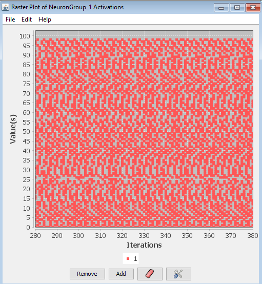

# Raster

A spike raster plot displays the spiking activity of a group of neurons over time (for more information see **this page**). In a raster plot each row (y-axis) corresponds to the index of a neuron in a neuron group. The columns (x-axis) corresponds to the current time in the simulation. The presence of a dot in a given row and column, indicates that the neuron whose index corresponds to that row produced an action potential (spike) at the time corresponding to that column. For instance, if neuron 2 spikes at time 10 a dot will appear in row 2 at the column representing the 10th time index. Extending this it can be seen that a raster plot displays the pattern of spikes across a neuron group over time.

## Component Panel

It should be noted that thus far raster plot has only been discussed in the context of spiking neurons. This is no coincidence, as this particular plot is only intended to work with spiking neurons. Although a user could send raw activation values to a raster plot, as of Simbrain 3.0 this will simply show up as a time-series of the activation values. To use raster plot be sure to couple the "spike indices" producer rather than the activation values. For more information see the discussion of vector couplings on the **network couplings** page.

## File

-**Import from xml**: Imports a raster chart from a stored .xml file.
-**Export to xml**: Exports the current raster chart to a .xml file.
-**Rename**: Renames current raster chart window.
-**Close**: Closes the current raster chart window

## Component Panel

- **Add**: Add representation of the spikes of a neuron group to the plot.
- **Remove**: Remove a time series of spikes of a neuron group from the plot.
- **Clear Graph Data**: Clears all data from the plot.
- **Show Graph Properties (Tool)**: Opens up properties menu for the plot. This could be found with the tools icon (to the right) of the button section (all the way down) or it could be found under the Edit section (on top) preferences
    * Auto Range:
    * Dot Size:
    * Window Size:
    * Range upper Bound:
    * Range Lower Bound:
    * Fixed width:
    * Spike Threshhold:

## Help

- **Help**: Link to Simbrain Documentation

## Right-Click Menu

- The context menu is a **[JFreeChart menu](./#jfreechart-right-click-menu)**.

