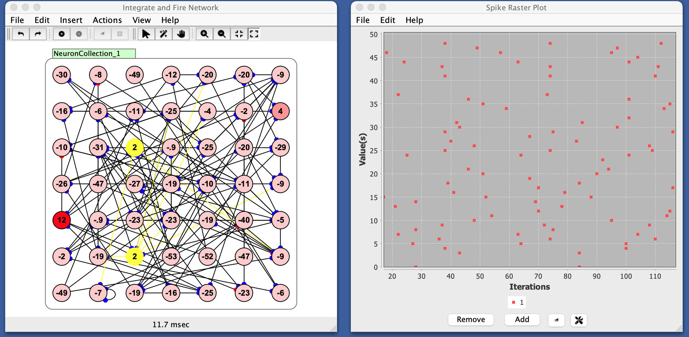

# Raster Plot

A raster plot is a graphical representation of spiking activity across a group of neurons over time. Each dot in the plot represents a spike by a neuron at a specific moment.
- The x-axis shows time steps.
- The y-axis shows neuron indices (often interpreted as "neuron number").
- A dot at position $$(t, i)$$ means neuron $$i$$ fired (spiked) at time $$t$$, or (for non-spiking neurons) that the neuron was active above a threshold.

Basically each row represents a single neuron's spiking activity over time.

When you see vertical alignments of dots, it means multiple neurons spiked at the same time: often a sign of synchrony or oscillations. The case shown below does not show much spiking synchrony.

<!-- TODO: An example that makes these vertical clusters -->
<!--  Idea: consider a network with a group of spiking int fire driven by a common oscillatory input. You should observe bursts of synchronized firing. Also try izhik
 -->

## Continuous vs. Spiking Neurons

Although raster plots are typically used with spiking neurons, Simbrain allows you to plot neuron activations too. In this case, "spikes" are inferred: if an activation value exceeds a [spike threshold](#spike-threshold) (default 0.5), a spike is shown.

When there is a vertical cluster, that means many neurons spiked at the same time, suggesting oscillations. Bands give a sense of the frequency of oscillation.

# Preferences
- **Dot Size**: Size of the dots in the chart.
- **Window Size**: How many time points can be contained in the window.
- **Fixed Width**: If true, the raster window never extends beyond the window size. If false, all data to date are plotted (which can start to consume quite a bit of memory).
- **Spike Threshold**: Threshold used to determine spiking with non-spiking neurons. For non-spiking neurons, activation above this value is treated as a spike.

# Panel Buttons
- **Add**: Add a raster plot series to the plot. Multiple raster plots, shown in different colors, can be superimposed.
- **Remove**: Remove a raster plot series from the plot.
- **Clear Graph Data**: Clear all data.
- **Show Graph Properties** (gear icon): Open preferences dialog.

# Menus

## File 
- **Import from XML**: Load a previously saved raster plot.
- **Export to XML**: Save the current raster plot.
- **Rename**: Rename the raster plot window.
- **Close**: Close the plot window.

## Edit
- **Preferences**: See [preferences](#preferences).

## Right-Click Menu

- The context menu is a [JFreeChart menu](./#jfreechart-right-click-menu).
