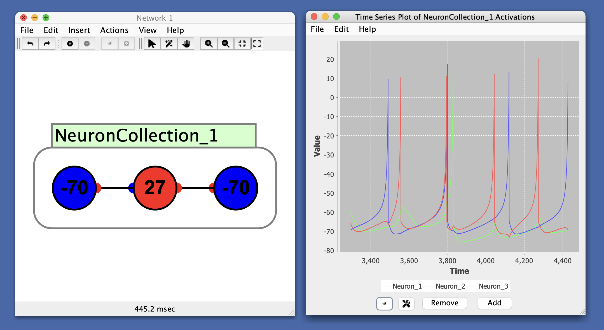

# Time Series

Time series plot allows you to track changes in a set of variables over time (time corresponds to **simulation time**, and is represented on the x-axis of the plot). For example, the spike pattern of a [spiking neuron](../network/spikingneurons.md) can be viewed by attaching the spiking neuron to a time series plot.

  
`Every line is associated with a making a change. Ex: Izhikevich neuron has visible spikes during changing membrane potentials`

# Panel Buttons

- **Add**: Add a time series to the plot.
- **Remove**: Remove a time series from the plot.
- **Clear Graph Data**: Clears all data from the plot.
- **Show Graph Properties**: Opens up properties menu for the plot.

# Menus

## File

- **Open**: Opens a time series from a stored .xml file.
- **Save**: Saves the current time series.
- **Save As**: Saves the current time series and allows you to specify a name for the file.
- **Close**: Closes the current time series.

## Edit

- **Preferences**: Allows you to set the pie chart's appearance.
- **Auto Range**: When selected, the y-axis is automatically scaled so that the series with the greatest magnitude fits inside the window. It can be useful to turn this off to get a better sense overall changes in magnitude since while it is on they will fill up the window.
- **Range Lower Bound**: Sets the minimum value of the y-axis.
- **Range Upper Bound**: Sets the maximum value of the y-axis.
- **Fixed Width**: When selected, maintains a fixed amount of time points displayed in the plot.
- **Window Size**: Sets the width of the x-axis.

## Help

- **Help**: Link to Simbrain Documentation

## Right-Click Menu

- The context menu is a **[JFreeChart menu](./#jfreechart-right-click-menu)**.