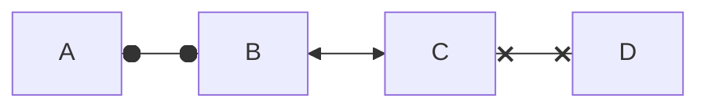

# Couplings

A coupling is a one-way informational link between two objects in a Simbrain simulation. Couplings allow information to flow between components in the Simbrain workspace (e.g. from a network to a bar chart). A coupling consists of a producer and a consumer. Producers and consumers are attributes.

The basic scheme is shown in the image below (this kind of depiction is used throughout these documents). The coupling contains a producer and consumer attribute which are of the same type, and it functions to pass information from the producer to the consumer. A producer gathers information from a source object and then passes the result to a target object.

[//]: # (for illustration purposes, should be removed later)

In the underlying java code, the producer is generally calling a "getter" function, which retrieves some information from a Simbrain object, and the consumer is generally passing information retrieved from a getter function on to a setter function.

# Coupling Types

There are different types of couplings, depending on the datatype of the underlying attributes. Currently Simbrain has three types of couplings

- Scalar couplings (doubles in the underlying code).
- Vector couplings (double-arrays). These are shown as green in the coupling manager.
- Text couplings (Strings). These are shown as blue in the coupling manager.
There could be other coupling types as well. The underlying code only requires that the producer and consumer in a coupling have the same data type.

Shown here an example of each type of coupling. To emphasize that attribute types must match, they are shown as "puzzle-pieces" which must be fit to each others: scalar attributes as interlocking triangular shapes, vector attributes as interlocking zig-zags , and text attributes as interlocking curves.

This graphical scheme is used to illustrate the various attributes and the ways couplings can be attached to types of icon are used throughout the documentation: e.g. in the and in the discussion of data world couplings .

# Scalar Couplings

An easy way to get a feel for how couplings work is through the example of scalar couplings. An example is shown below that links a Network to an OdorWorld. In this example one of the couplings in the pursuer simulation is shown (the simulation has 5 couplings total, one for each neuron). The coupling shown takes the current activation of the "turn right" neuron (the producer) and sends it to the turn right action on the mouse (the consumer). Note that in this example, the mouse will turn right when the workspace is updated, because there is more right turning activation than left turning activation.

There are many examples of scalar couplings that can be made. Here are some examples where the producer is a neuron:

- A coupling from a single neuron to a single neuron in another network.
- A coupling from a neuron's activation to a bar in a bar chart.
- A coupling from a neuron's activation to an agent's "motor" (turn left, turn right, go straight)
- A coupling from a neuron's activation to a specific column in a Data World. If the data world is in iteration mode, then with each iteration of the workspace the current neuron activation is "logged" in a specific column of the dataworld.
- A coupling from a neuron's activation to text in a Text World. For example, when the neuron is active above .5 make the word "hello" appear in the text world

# Couplings Diagram
Here are some examples where the consumer is a neuron:

- A coupling from an agent's sensor level to a neuron.
- A coupling from a column in a dataworld to a neuron's activation. With each iteration of the workspace the neuron's activation is set based on the data in a specific column of the table.
- A coupling from a Text World letter detector (that is activated when a specific letter is parsed) to a neuron.

# Vector Couplings

The basic idea with vector couplings is the same as with scalar couplings, but they involve lists of numbers. In the image shown below, we see that the producer is the whole neuron group (which is interfaced with via the interaction box), and the consumer is the whole histogram component. The coupling takes an activation vector, consisting of the 9 activation values of the network, and sends it to the the histogram. As can be seen, two neurons have activations below 0, three have activations betwen .5 and 1, three have activations of 2, and one has an activation above 2.

These vectors can get huge! Tens of thousands of neuron activations! As with scalar couplings, there are many types of activations that can be made.Here are some examples where the producer is a neuron group:

- A coupling from one neuron group to another.
- A coupling from a neuron groups' activations to most types of chart.
- A coupling from a neuron group to a data world. On each iteration of the workspace the current activations of the neuron group are used to set the value of the current row of the data world. In this way activations can be logged and viewed in realtime.
- A coupling from a neuron group's activation to text in a Text World. For example, when a vector is close enough to a specific vector (in a vector space) make the word "hello" appear in the text world.

# Couplings Diagram
Here are some examples where the consumer is a neuron group:

- A coupling from an agent's sensor vector to a neuron group.
- A coupling from a DataWorld to a neuron group. On each iteration of the workspace the current row of the data world is used to set the values of the neuron group's neurons.
- A coupling from a Display World dictionary (which associates words with vectors) to a neuron group.
Attributes

An attribute is any part of a component which has a value that may be sent to or recieved from another component, i.e. something that produces values or consumes values. Examples are neuron activations, weight strengths, or bars on a bar chart, or sensor values for an agent in a virtual world. A coupling is a pair that contains one producing attribute and one consuming attribute.

Most windows in Simbrain (i.e. workspace components) are wrappers around other objects (e.g. neurons), whose values can be linked to one another. These values are attributes and can (for instance) include such values as the activation of a given neuron in the workspace, or a value of a line on a time-series. Attributes can be thought of as the "hooks" or "anchor points" that make up couplings, and couplings represent the uni-directional data flow between these hooks. For example, a simulation might involve coupling neurons whose neurons are producers to a bar chart whose bars are consumers (to see this, try bar chart test in the script menu).

Each attribute has a data type, as described above: currently scalar (double), vector (array of doubles), and String.

If some property of an object is not available as an attribute, it can be accessed via a script, or you can request that it be added as an explicit dialog by posting an issue at the developer site

The attributes in a component can be viewed in the coupling manager dialog.

# Attribute Visibility

Not all attributes are automatically "visible" in the relevant gui components (coupling manager, menus, etc. described below). The reason is that there are so many things that can be attributes (every numerical property of every neuron and synapse in a neural network, for example), that it would overwhelm the gui. Each component has some attributes visible by default. To modify what the visible attributes are, use the set attribute visibility dialog, accessible from the coupling manager. For example, in this dialog, we see available attributes for the currently selected network component. Only neuron activations are visible in this component. When clicking on the visibility checkboxes notice that attributes appear and disappear in the producer list window.

# Coupling Manager

The most comprehensive graphical access to couplings in Simbrain is via the coupling manager. It can be used to view attributes and couplings, and to create couplings. To open the manager, press the coupling manager button coupling icon on the Simbrain toolbar or use the menu Couplings > Coupling Manager. The coupling manager allows you to create and delete couplings, set attribute visibility, and view workspace attributes.

The coupling manager is organized in to three columns. Multiple items in each of these three columns can be selected by holding the shift key while selecting items or ranges of items.

Producer / Consumer lists: these are the columns on the left and right side of the coupling manager: producers on the left; consumers on the right. Intuitively you are connecting a consumer to a producer to produce a coupling, which is displayed in the middle. The drop down box at the top of each column shows all current workspace components. Selecting that component shows what producing or consuming attributes are currently visible in that component.

Coupling list: this is the middle column of the coupling manager and it shows all current couplings in the workspace. The type of the coupling is color coded, as described above. The same view is also available in the coupling tab of the property tabs.

The following commands are possible in the coupling manager:

Add coupling(s): This button creates new couplings, as follows. It begins with the first selected attribute in the producer list and the first selected attribute in the producer list, and then creates a coupling between those attributes. If multiple consumers and producers are selected it creates as many couplings as it can in this way. The default is to link each selected producer with one selected consumer, but if many-one is selected in the drop-down box next to the add coupling(s) button, then multiple couplings are created, one for each combination of selected producers and consumers.
Delete Couplings: This button deletes all selected couplings from the coupling list.

Set Attribute Visibilities: This button opens up the attribute visibility dialog for the currently selected consumer or producer list.

# Coupling Creation

There are at least 3 ways to create couplings:

1. Use the coupling manager, as described above.
2. Via context menus inside specific components, which can be very convenient. Right click on a neuron to create a scalar coupling to or from a neuron, or on a neuron group's interaction box to create a vector coupling to or from a neuron group. When you do so a context menu will point you to all other potential consuming and producing attributes in the whole workspace. An example of creating a scalar coupling between a neuron and one time series in a time series plot is shown below. An example is shown in the screenshot below.
3. Using scripts one create couplings programmatically. Several of the scripts in the script menu create couplings, and the user is encouraged to look at this code to see how couplings can be created in this way.
